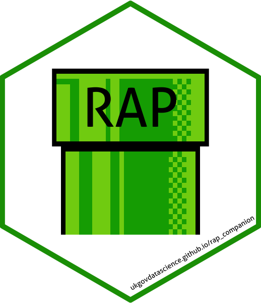

```{r setup, include=FALSE}
htmltools::tagList(rmarkdown::html_dependency_font_awesome())
knitr::opts_chunk$set(echo = TRUE, eval = TRUE)
```

```{r, echo = F, eval = F}

library(jsonlite)
library(icon)


```


class:  left, top
# Environment
`r icon::fa_building(size = 3, pull= "right")`


```{r, echo = F}
office <- c("Statistical Office", "Official Statistics", "Public Administration")
it <- c("closed up IT infrastructure", "no admin rights", "very rigid firewall")
staff <- c("social scientists", "Excel natives","R training «on-the-job»")


```

```{r, echo = T, eval = F}
ls()
```

```{r, echo = F, eval = T}
noquote(ls())
```

## Office
```{r, echo = F, size = 15, eval = T}
noquote(office)
```

## IT
```{r, echo = F, size = 15, eval = T}
noquote(it)
```


## Users
```{r, echo = F, size = 15, eval = T}
noquote(staff)

```


---


class:  left, top
# Mission
<!-- `r icon::fa_trophy(size = 3, pull= "right")` -->
## Reproducible Analytical Pipelines

<br>

<font size = "20"> <b> GOV.UK Data in Government </b></font> 

[**Transforming the process of producing official statistics**](https://dataingovernment.blog.gov.uk/2017/11/27/transforming-the-process-of-producing-official-statistics/)

[**Reproducible Analytical Pipelines**](https://dataingovernment.blog.gov.uk/2017/03/27/reproducible-analytical-pipeline/)

[**RAP Companion**](https://ukgovdatascience.github.io/rap_companion/)


.right[]


---

class: top, left

# Where did we start?
`r icon::fa_cogs(size = 3, pull = "right")`


### Workflow


<br>

.right[[**Source: UK.GOV RAP**](https://dataingovernment.blog.gov.uk/2017/03/27/reproducible-analytical-pipeline/)]

---
class: top, left

# How to get there?
`r icon::fa_location_arrow(size = 3, pull = "right")`

<br>
## Tools

`r icon::fa_wrench(size = 5)`

<br>

## Culture

`r icon::fa_people_carry(size = 5)`


---


class: top, left

# Tools
`r icon::fa_wrench(size = 3, pull = "right")`
## Corporate Design Toolbox

- color palettes
- ggplot themes
- export formatted excel tables (with openxlsx)
- layouted pdf reports (via Rmarkdown & LaTeX)
  
---


class: top, left

# Tools
`r icon::fa_wrench(size = 3, pull = "right")`
## Data base workflow

- input data is in our db, NOT in csv
- read & write from/to OracleDB
- Package: ROralce
- future: dbplyr?
  
---


class: top, left

# Tools
`r icon::fa_wrench(size = 3, pull = "right")`
## Reproducability

### Infrastructure
- RStudio Server
- Git/Github

### Dependency management: 
- docker is too much overhead
- packarat vs. checkpoint
- is drake an option?

### R
- RProjects
- RPackages


---

class: top, left

# Culture
`r icon::fa_users(size = 3, pull = "right")`
## R Programming

- more:
  - reusable code snippets
  - functions
  - Code review
  - Code style guide
  
- less:
  - copy & paste
  - 1000 line long R scripts

---


class: top, left

# Culture
`r icon::fa_users(size = 3, pull = "right")`
## Community: internal

- internal RMeetups (~6 weeks)
- show & tell
- ask & learn

---

class: top, left

# Culture
`r icon::fa_users(size = 3, pull = "right")`
## Community: Zurich R User Group
### «The use of R in public administration»


.pull-left[]
.pull-right[
<br>
.right[https://statistikzh.github.io/RMeetup]]  


---


class: top, left

# Culture
`r icon::fa_users(size = 3, pull = "right")`
## Community

### open source data pipes

<blockquote class="twitter-tweet" data-lang="de"><p lang="en" dir="ltr">Thanks <a href="https://twitter.com/statistik_zh?ref_src=twsrc%5Etfw">@statistik_zh</a> <a href="https://twitter.com/schnllr?ref_src=twsrc%5Etfw">@schnllr</a> for the warm welcome and nice platform to present <a href="https://twitter.com/KOFETH?ref_src=twsrc%5Etfw">@KOFETH</a> &#39;s open source driven data pipes. Go <a href="https://twitter.com/hashtag/swiss?src=hash&amp;ref_src=twsrc%5Etfw">#swiss</a> <a href="https://twitter.com/hashtag/rstats?src=hash&amp;ref_src=twsrc%5Etfw">#rstats</a>! <a href="https://t.co/OmX2WCjr6o">pic.twitter.com/OmX2WCjr6o</a></p>&mdash; Matt Bannert (@whatsgoodio) <a href="https://twitter.com/whatsgoodio/status/951470783322316800?ref_src=twsrc%5Etfw">11. Januar 2018</a></blockquote>
<script async src="https://platform.twitter.com/widgets.js" charset="utf-8"></script>

### git for researchers

<blockquote class="twitter-tweet" data-lang="de"><p lang="en" dir="ltr"><a href="https://twitter.com/hashtag/Git?src=hash&amp;ref_src=twsrc%5Etfw">#Git</a>, <a href="https://twitter.com/hashtag/Github?src=hash&amp;ref_src=twsrc%5Etfw">#Github</a>, <a href="https://twitter.com/hashtag/Gitlab?src=hash&amp;ref_src=twsrc%5Etfw">#Gitlab</a> and <a href="https://twitter.com/hashtag/bitbucket?src=hash&amp;ref_src=twsrc%5Etfw">#bitbucket</a> in Academic Research and Official Statistics. Here are the slides of my workshop <a href="https://twitter.com/KOFETH?ref_src=twsrc%5Etfw">@KOFETH</a>: <a href="https://t.co/1v47gW1pUa">https://t.co/1v47gW1pUa</a> . Thanks <a href="https://twitter.com/statistik_zh?ref_src=twsrc%5Etfw">@statistik_zh</a> and everyone else for your time and great participation! <a href="https://twitter.com/hashtag/swissdata?src=hash&amp;ref_src=twsrc%5Etfw">#swissdata</a></p>&mdash; Matt Bannert (@whatsgoodio) <a href="https://twitter.com/whatsgoodio/status/978589018278514688?ref_src=twsrc%5Etfw">27. März 2018</a></blockquote>
<script async src="https://platform.twitter.com/widgets.js" charset="utf-8"></script>


---


class: top, left

# Road ahead
`r icon::fa_road(size = 3, pull = "right")`

## Tools
- packrat or equivalent
- git
- Rs

## Culture
- cooperation
- style guide


---


background-image: url("libs/sticker-01.png")
background-position: bottom right
background-size:30%

class: top, left


<font color=#009ee0 size = "30"> <b> Thanks!</b></font> 

<br>


Andrea Schnell  
[andrea.schnell@statistik.ji.zh.ch](mailto:andrea.schnell@statistik.ji.zh.ch)  

`r icon::fa_twitter(size = 1)` <a href="https://twitter.com/statistik_zh?ref_src=twsrc%5Etfw" class="twitter-follow-button" data-show-count="false">@schnllr</a><script async src="https://platform.twitter.com/widgets.js" charset="utf-8"></script>

`r icon::fa_github(size = 1)` https://schnllr.github.io/eRum  

<br>
Statistical Office Canton of Zurich  

`r icon::fa_twitter(size = 1)` <a href="https://twitter.com/statistik_zh?ref_src=twsrc%5Etfw" class="twitter-follow-button" data-show-count="false">@statistik_zh</a><script async src="https://platform.twitter.com/widgets.js" charset="utf-8"></script>

<br>
<br>
<small>Slides created via the R package [**xaringan**](https://github.com/yihui/xaringan).</small>


<!-- .right[] -->
